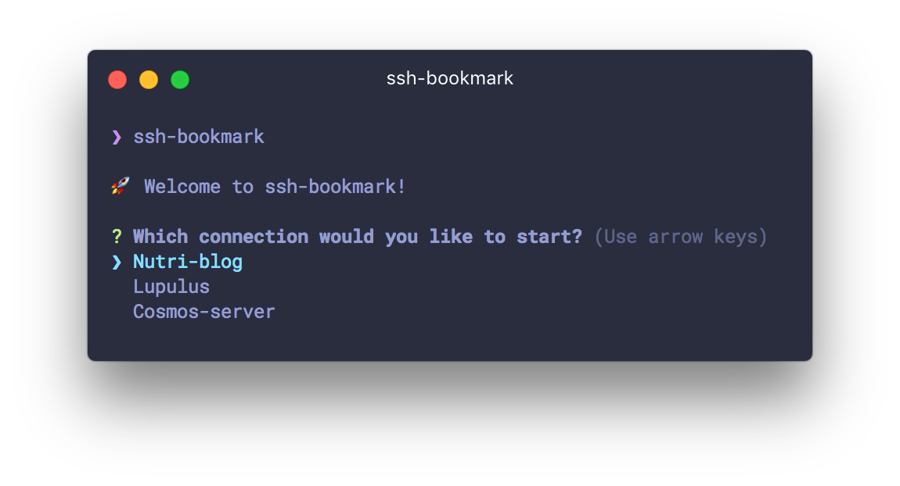

# ssh-bookmark

A command-line utility to help you connect to your SSH endpoints



## Installation

`npm i -g ssh-bookmark`

## Usage

```
$ ssh-bookmark
// Browse your ssh bookmarks and pick one to connect to

$ ssh-bookmark -h
// Display help

$ ssh-bookmark -a user@host.example
// Bookmark a host

$ ssh-bookmark -r my-bookmark-name
// Remove a bookmark

$ ssh-bookmark -b my-bookmark-name
// Connect to the specified bookmark directly
```

🚀 Nice and simple. 

